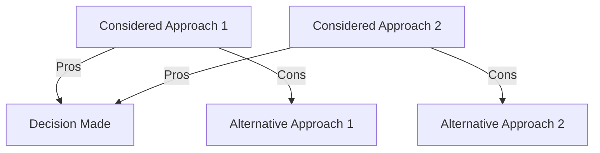

```markdown
# Pull Request Template

## Summary

Please include a summary of the changes and the related issue. Please also include relevant motivation and context. List any dependencies that are required for this change.

Fixes # (issue)

## Type of change

Please delete options that are not relevant.

- [ ] Bug fix (non-breaking change which fixes an issue)
- [ ] New feature (non-breaking change which adds functionality)
- [ ] Breaking change (fix or feature that would cause existing functionality to not work as expected)
- [ ] This change requires a documentation update

## Testing

Please describe the tests that you ran to verify your changes. Provide instructions so we can reproduce. Please also list any relevant details for your test configuration.

- [ ] Unit tests
- [ ] Integration tests
- [ ] End-to-end tests
- [ ] Manual tests

## Tradeoffs/Decisions Made

This section is mandatory. Please document the tradeoffs and decisions made during the development of this PR. Include the reasoning behind each decision and any alternative approaches considered.



## Performance Impact

Please describe the performance impact of your changes. Include benchmarks, metrics, or other relevant data. If applicable, provide before and after comparisons.

| Metric               | Before | After  | Change |
|----------------------|--------|--------|--------|
| Latency (ms)         | 100    | 90     | -10%   |
| Throughput (req/sec) | 50     | 60     | +20%   |

## Breaking Changes

Please list any breaking changes. If there are none, please state that.

- Breaking change 1
- Breaking change 2

## Screenshots/Demo

If applicable, add screenshots or a demo to help explain your changes.


```