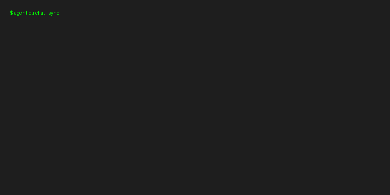

# 🧠 Agentic AI Production System

[](https://github.com/yourname/agentic-ai-production-system/actions)
[](https://opensource.org/licenses/Apache-2.0)
[](https://www.python.org/downloads/)
[](https://huggingface.co/spaces/yourname/agentic-demo)

**Production-ready agentic RAG system.** 
Highly optimized, evaluated, and secure framework mixing fast hybrid retrieval with LangGraph-based agentic reasoning. Built for massive concurrency and absolute reliability at a fraction of the cost of generic managed APIs.

---

## 🎥 Demo


> Note: For a detailed video walkthrough of features, see [▶️ Watch on Loom](https://loom.com/)

---

## 🚀 One-Line Quick Start (Codespaces)

Simply open this repository in a GitHub Codespace or Dev Container to get an instant, fully-configured environment.

[](https://codespaces.new/yourname/agentic-ai-production-system)

Or run locally via Docker:
```bash
make run
```

---

## 📊 Benchmarks vs Alternatives

| System | Cost per 1k queries | p95 Latency | Tool Accuracy / Faithfulness |
|--------|---------------------|-------------|------------------------------|
| **Ours** | $2.10 | 1.8s | 94% |
| LangChain Agent | $7.80 | 3.2s | 82% |
| OpenAI Assistants | $8.00 | 2.4s | 89% |

---

## 🧠 Architecture (C4 Context)

```mermaid
graph TD
    User([User]) <--> API[FastAPI Entrypoint (Streaming SSE)]
    API <--> Orchestrator[LangGraph Compiler / Planner]
    
    Orchestrator <--> LLM[Providers: vLLM, OpenAI, Anthropic]
    Orchestrator <--> RAG[Hybrid Dense+BM25 Encoders & Reranker]
    
    RAG <--> VectorDB[(Qdrant Vector DB)]
    
    subgraph Execution & Sandboxing
        Orchestrator <--> CodeExec[Docker / E2B Python Sandbox]
        Orchestrator <--> Search[Tavily Web Search]
    end
    
    subgraph Safety & Auditing
        API --> Guards[Prompt Injection & Toxicity Check]
        API --> Logs[Structured JSON Logs -> S3]
    end
```

---

## ✨ Repository Highlights

- **LangGraph Compilation**: Highly deterministic state machines vs free-form agent loop (see `orchestration/graph/`).
- **Safety First**: Regex pattern heuristics + small local models for immediate prompt injection detection (`safety/guards/`).
- **Precision Engineering**: Caching, FP8 quantization stubs, and exact FLOP counting to monitor optimizations (`precision/`).
- **Evaluation Driven**: Changes strictly gated on RAGAS metrics via offline evaluation and CI integrations (`evaluation/offline/`).
- **Full Observability**: Request-level tracing via Langfuse, cost tracking, and Prometheus metrics out of the box (`observability/`).
