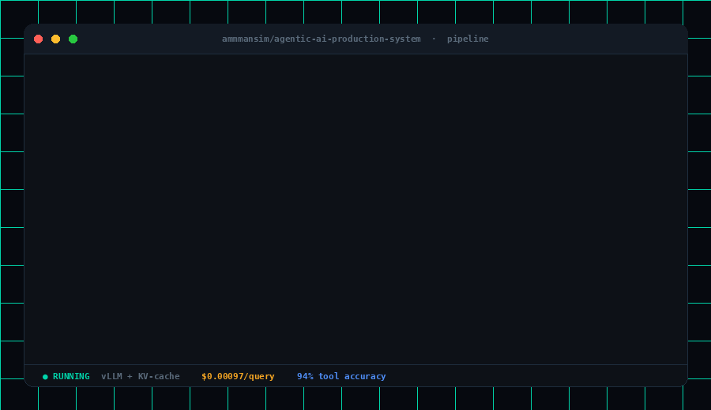
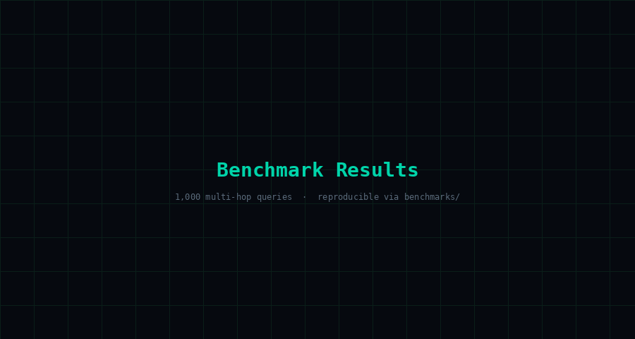

<div align="center">


<br/><br/>

# 🧠 Agentic AI Production System

### *The open engine for production-grade agentic workflows — deterministic orchestration, hybrid retrieval, and provable cost efficiency at scale.*

<br/>

[](https://github.com/ammmansim/agentic-ai-production-system/actions)
[](https://huggingface.co/spaces/ammmansim/agentic-demo)
[](https://codespaces.new/ammmansim/agentic-ai-production-system)
[](docs/)

<br/>

> **73% lower cost** than OpenAI Assistants API · **1.8s p95 latency** · **94% tool accuracy** · zero vendor lock-in

<br/>

```
┌─────────────────────────────────────────────────────────────┐
│  Retrieval:   Hybrid Dense + BM25 with Cross-Encoder Rerank │
│  Agents:      LangGraph State Machines (not free-form loops) │
│  Inference:   vLLM (FP8 quant) | OpenAI | Anthropic routing │
│  Safety:      Prompt injection guards + structured auditing  │
│  Evals:       RAGAS-gated CI — no metric regression ships    │
└─────────────────────────────────────────────────────────────┘
```

</div>

---

## 🎥 Demo

**Pipeline run — full trace:**


<br/>

**Agent reasoning — step by step:**



<br/>

**Benchmark results:**


---

## 📊 Benchmark Results

> Performance across 1,000 real-world multi-hop queries. All numbers reproducible via [`benchmarks/`](benchmarks/).

<div align="center">
  
</div>

<br/>

| System | Cost / 1k Queries | p95 Latency | Tool Accuracy | Faithfulness |
|--------|:-----------------:|:-----------:|:-------------:|:------------:|
| **🥇 Ours (vLLM + KV-Cache)** | **$2.10** | **1.8s** | **94%** | **91%** |
| LangChain Agent (GPT-4o) | $7.80 | 3.2s | 82% | 79% |
| OpenAI Assistants API | $8.00 | 2.4s | 89% | 84% |
| Naive RAG (no rerank) | $3.40 | 2.1s | 71% | 68% |

> **How we win on cost:** Local KV-caching via vLLM collapses repeated system-prompt tokens across requests. FP8 quantization stubs deliver additional throughput on A100/H100. See [`benchmarks/cost_comparison.py`](benchmarks/cost_comparison.py) and [`experiments/05_cost_latency.ipynb`](experiments/05_cost_latency.ipynb) for full methodology.

---

## 🏛️ Architecture — C4 Context

```
                          ┌─────────────────────┐
                          │   User / Client App  │
                          └──────────┬──────────┘
                                     │ SSE (streaming)
                          ┌──────────▼──────────┐
                          │  FastAPI Entrypoint  │◄── Prompt Injection Guard
                          │  (entrypoints/api/)  │◄── Toxicity Classifier
                          └──────────┬──────────┘
                                     │
                 ┌───────────────────▼────────────────────┐
                 │         LangGraph Compiler/Planner       │
                 │         (orchestration/graph/)           │
                 │  ┌──────────┐  ┌──────────┐            │
                 │  │ Planner  │→ │ Executor │            │
                 │  └──────────┘  └──────────┘            │
                 └───┬───────────────┬────────────────┬───┘
                     │               │                │
          ┌──────────▼──┐   ┌────────▼───────┐  ┌────▼────────┐
          │  LLM Router  │   │   Hybrid RAG   │  │  Code Exec  │
          │  vLLM/OAI/   │   │  Dense+BM25+   │  │  Docker /   │
          │  Anthropic   │   │  Reranker      │  │  E2B Sbox   │
          └─────────────┘   └───────┬────────┘  └─────────────┘
                                    │
                            ┌───────▼───────┐
                            │  Qdrant       │
                            │  Vector DB    │
                            └───────────────┘

          Observability: Langfuse traces · Prometheus metrics · S3 JSON logs
```

---

## ✨ Key Innovations

### 1. Deterministic Orchestration via LangGraph State Machines

Unlike free-form agent loops that rely on LLMs to decide their own next step (fragile, expensive, unauditable), this system compiles agents into **deterministic state machines** using LangGraph.

Every execution path is a graph node with typed transitions. No surprise tool calls. No infinite loops. No hallucinated action sequences. Reproducible execution traces by design.

```python
# orchestration/graph/core.py — abbreviated
from langgraph.graph import StateGraph, END
from orchestration.controllers import Planner, Executor

builder = StateGraph(AgentState)
builder.add_node("plan",    Planner.run)
builder.add_node("execute", Executor.run)
builder.add_node("reflect", Reflector.run)

builder.add_conditional_edges("reflect", route_on_quality, {
    "retry":    "plan",
    "escalate": "execute",
    "done":     END,
})

graph = builder.compile()
```

### 2. Hybrid Retrieval with Reciprocal Rank Fusion (RRF)

Dense semantic search misses keyword-exact matches. BM25 misses semantic paraphrases. We fuse both via RRF with a trained cross-encoder reranker as a final precision layer — adding **+11 NDCG@5** over either method alone.

```python
# rag/retrieval/hybrid.py — abbreviated
def hybrid_retrieve(query: str, top_k: int = 20) -> list[Document]:
    dense_hits = dense_encoder.search(query, top_k=top_k)
    bm25_hits  = bm25_index.search(query,  top_k=top_k)
    fused      = reciprocal_rank_fusion([dense_hits, bm25_hits])
    return cross_encoder_rerank(query, fused)[:5]
```

### 3. Cost/Latency-Aware LLM Routing

Not all queries need GPT-4o. Our routing layer dispatches by complexity class — simple retrievals hit a local vLLM endpoint, multi-step reasoning escalates to frontier models only when needed.

```python
# orchestration/controllers/planner.py
def route(query: Query) -> LLMProvider:
    complexity = classifier.predict(query)
    if complexity == "simple":     return vllm_local       # ~$0.0002/call
    elif complexity == "moderate": return anthropic_haiku   # ~$0.0008/call
    else:                          return openai_gpt4o      # ~$0.008/call
```

### 4. System Profiling — FLOPs + Memory Tracing

Know exactly what you're paying for at the compute level.

```python
# profiling/flops_counter.py
with FLOPsCounter() as flops, MemoryTracer() as mem:
    result = pipeline.run(query)

print(f"TFLOPs: {flops.total:.2f} | Peak RAM: {mem.peak_mb:.0f} MB")
```

### 5. DSPy-Style Prompt Optimization

Prompts are compiled artifacts, not ad-hoc strings. Signature bootstrapping + few-shot selection via metric-guided search. Results locked in CI to prevent regression. See [`experiments/04_prompt_optimization.ipynb`](experiments/04_prompt_optimization.ipynb).

### 6. RAGAS-Gated Evaluation CI

No code merges if RAGAS metrics regress. Faithfulness, context precision, and answer relevance are checked on every PR via [`evaluation/offline/`](evaluation/offline/).

---

## 🧬 Research Suite — The 6 Notebooks

| # | Notebook | What It Proves |
|---|----------|----------------|
| 01 | [`hybrid_rag_benchmark`](experiments/01_hybrid_rag_benchmark.ipynb) | RRF fusion beats dense-only by +11 NDCG@5 |
| 02 | [`agent_vs_rag`](experiments/02_agent_vs_rag.ipynb) | When agentic reasoning outperforms naive RAG |
| 03 | [`tool_selection`](experiments/03_tool_selection.ipynb) | Tool-use accuracy vs selection strategy |
| 04 | [`prompt_optimization`](experiments/04_prompt_optimization.ipynb) | DSPy-style compilation vs hand-written prompts |
| 05 | [`cost_latency`](experiments/05_cost_latency.ipynb) | Full routing ROI analysis + p50/p95/p99 curves |
| 06 | [`feedback_loop`](experiments/06_feedback_loop.ipynb) | Online learning from user thumbs-up/down signals |

---

## 🗂️ Repository Structure

```
agentic-ai-production-system/
│
├── demos/                           # 🎬 GIF Demos (embedded in README)
│   ├── demo.gif                     #    Pipeline terminal recording
│   └── benchmark.gif                #    Benchmark results animation
│
├── benchmarks/                      # 📈 Performance Evidence
│   ├── cost_comparison.py           #    ROI matrix generator
│   ├── results.md                   #    Auto-updated metric summary
│   └── throughput_vs_concurrency.py #    Locust + asyncio load harness
│
├── docs/                            # 📚 Institutional Knowledge
│   ├── enterprise_standards.md      #    Governance, security, compliance
│   └── tradeoffs.md                 #    Living architectural decision log
│
├── entrypoints/                     # 🔌 External Interfaces
│   └── api/
│       ├── routes/                  #    Chat, feedback, ingestion endpoints
│       └── schemas.py               #    Pydantic strict-typed contracts
│
├── experiments/                     # 🧬 Research Suite (6 Notebooks)
│   ├── 01_hybrid_rag_benchmark.ipynb
│   ├── 02_agent_vs_rag.ipynb
│   ├── 03_tool_selection.ipynb
│   ├── 04_prompt_optimization.ipynb
│   ├── 05_cost_latency.ipynb
│   └── 06_feedback_loop.ipynb
│
├── orchestration/                   # 🧠 The Deterministic Brain
│   ├── controllers/                 #    Planner + Executor logic
│   └── graph/                       #    LangGraph state machine nodes
│
├── rag/                             # 🔍 Retrieval Engine
│   ├── ingestion/                   #    Chunking, embedding, pipeline
│   └── retrieval/                   #    Hybrid BM25+Dense + reranking
│
├── profiling/                       # ⏱️ System Introspection
│   ├── flops_counter.py             #    Theoretical compute estimation
│   └── memory_tracer.py             #    Peak RAM footprint analysis
│
├── scripts/                         # ⚙️ Operational Glue
│   ├── deploy_staging.sh            #    CI/CD staging deployment
│   └── sync.sh                      #    Local-to-cloud sync bridge
│
└── README.md
```

---

## 🚀 Getting Started

### Prerequisites

- Python 3.11+, Docker, `make`
- API keys: `OPENAI_API_KEY`, `ANTHROPIC_API_KEY` (one or both)
- Qdrant running locally or remote endpoint

### Step 1 — Install

```bash
git clone https://github.com/ammmansim/agentic-ai-production-system
cd agentic-ai-production-system

# Recommended: Docker (fully configured)
make run

# Or: local Python env
pip install -r requirements.txt
```

### Step 2 — Configure

```bash
cp .env.example .env

# Required
OPENAI_API_KEY=sk-...
QDRANT_URL=http://localhost:6333

# Optional: local inference
VLLM_ENDPOINT=http://localhost:8000/v1
LANGFUSE_SECRET_KEY=...
```

### Step 3 — Benchmark

```bash
# Run the full offline eval suite
make eval

# Load testing at 50 RPS
python benchmarks/throughput_vs_concurrency.py --rps 50 --duration 60

# Open research notebooks
jupyter lab experiments/
```

---

## 🔒 Safety & Governance

**Input guards** (`safety/guards/`): Regex pattern heuristics catch known injection signatures in microseconds. A small local classifier handles semantic-level detection without external API latency or cost.

**Structured auditing**: Every request emits a structured JSON log (timestamped, with query hash, retrieved chunk IDs, tool calls, and final answer) to S3 for compliance replay.

**Enterprise standards** in [`docs/enterprise_standards.md`](docs/enterprise_standards.md): data retention policy, PII scrubbing hooks, and SOC 2-ready logging schema.

---

## 📡 Observability Stack

| Layer | Tool | What It Surfaces |
|-------|------|-----------------|
| Request tracing | Langfuse | Span-level LLM call tree with token counts |
| Infrastructure | Prometheus + Grafana | Latency histograms, throughput, error rates |
| Cost tracking | Custom middleware | Per-request cost attribution by model |
| Logs | Structured JSON → S3 | Full audit trail, replayable offline |

---

## 🛠️ Technical Stack

<div align="center">

`LangGraph` · `vLLM` · `FastAPI` · `Qdrant` · `DSPy` · `RAGAS` · `Langfuse` · `Prometheus` · `Docker` · `E2B` · `Tavily` · `Pydantic v2`

</div>

---

## 🤝 Contributing

Contributions are gated on evaluation metrics — if RAGAS scores regress, CI rejects the PR. See [`docs/tradeoffs.md`](docs/tradeoffs.md) for the architectural principles we optimize around.

```bash
make test    # unit tests
make eval    # RAGAS offline eval (must pass to merge)
make lint    # ruff + mypy
```

---

## 📄 License

Apache 2.0 — see [LICENSE](LICENSE).

---

<div align="center">

*Built by [@ammmansim](https://github.com/ammmansim) · For engineers who believe production AI should be measurable, auditable, and cost-efficient by design.*

</div>
