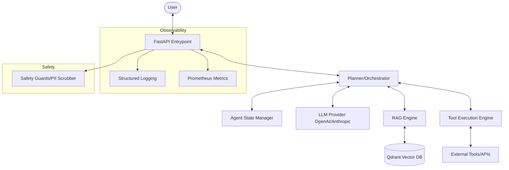

# 🏗️ System Architecture

## Overview
The Agentic AI Production System is designed as a modular, scalable framework for building and deploying agentic RAG applications.

## Component Diagram

## Data Flow
1. **Request**: User sends a query to the API.
2. **Safety Check**: Input is validated for prompt injection and PII.
3. **Planning**: The Orchestrator uses an LLM to plan the response.
4. **RAG**: Relevant context is retrieved from the Vector DB.
5. **Execution**: If tools are needed, the Execution engine runs them safely.
6. **Response Generation**: The final answer is synthesized and scrubbed for safety.
7. **Observability**: Every step is logged and metrics are collected.
