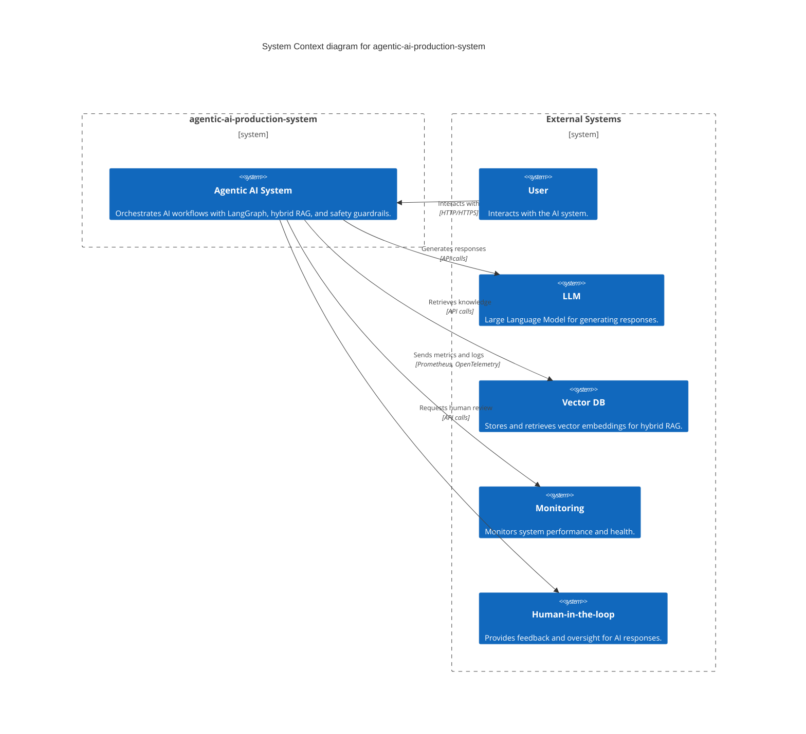
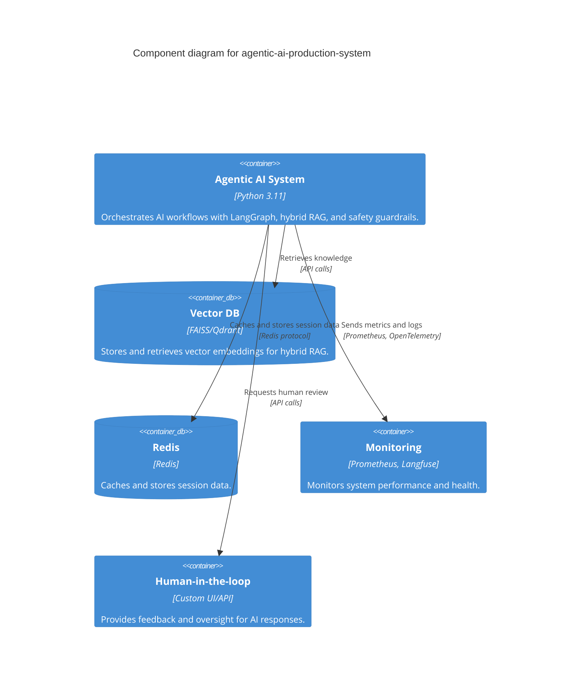
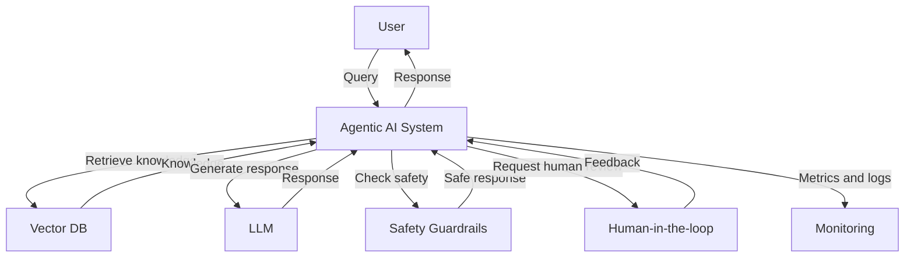

```markdown
# Architecture

## Overview

The `agentic-ai-production-system` is a production-grade agentic AI system designed to orchestrate complex AI workflows with a focus on reliability, scalability, and observability. The system leverages LangGraph for orchestration, hybrid RAG for knowledge retrieval, safety guardrails to ensure responsible AI usage, RAGAS for evaluation, and Prometheus + Langfuse for observability. The system is containerized using Docker and deployed on Kubernetes with Horizontal Pod Autoscaler (HPA) for scalability. Human-in-the-loop capabilities are integrated to ensure quality and safety.

## C4 Context Diagram



## Component Diagram



## Data Flow Diagram



## Key Design Decisions

1. **LangGraph Orchestration**: Chosen for its robust workflow orchestration capabilities, allowing for complex AI workflows to be defined and managed efficiently.
2. **Hybrid RAG**: Combines dense and sparse retrieval methods to improve the quality and relevance of retrieved knowledge.
3. **Safety Guardrails**: Implemented to detect and prevent PII exposure, toxicity, and injection attacks, ensuring responsible AI usage.
4. **RAGAS Evaluation**: Used for evaluating the quality of generated responses, ensuring the system meets performance benchmarks.
5. **Prometheus + Langfuse Observability**: Provides comprehensive monitoring and observability, helping to maintain system health and performance.
6. **Kubernetes Deployment with HPA**: Ensures the system can scale horizontally to handle varying loads, providing both reliability and cost efficiency.
7. **Human-in-the-loop**: Integrated to ensure quality and safety, allowing human oversight and feedback for critical AI responses.

## Technology Choices with Rationales

| Technology | Rationale |
|------------|-----------|
| Python 3.11 | Chosen for its performance, extensive libraries, and strong community support. |
| LangGraph | Provides robust workflow orchestration capabilities for complex AI workflows. |
| LangChain | Offers a comprehensive set of tools and utilities for building AI applications. |
| FastAPI | Used for its high performance, ease of use, and automatic API documentation. |
| FAISS/Qdrant | Chosen for their efficient vector storage and retrieval capabilities. |
| Redis | Provides fast in-memory data storage and caching for session data. |
| Prometheus | Offers robust monitoring and alerting capabilities for system health. |
| OpenTelemetry | Provides comprehensive observability, including metrics, logs, and traces. |
| Langfuse | Specialized in AI observability, providing insights into AI model performance. |
| Docker | Ensures consistent deployment and scaling of the system. |
| Kubernetes | Provides orchestration, scaling, and management of containerized applications. |
| Terraform | Used for infrastructure as code, ensuring reproducible and scalable deployments. |

## Conclusion

The `agentic-ai-production-system` is designed with a focus on reliability, scalability, and observability. By leveraging LangGraph for orchestration, hybrid RAG for knowledge retrieval, and safety guardrails for responsible AI usage, the system ensures high-quality AI workflows. The integration of Prometheus + Langfuse for observability and Kubernetes with HPA for deployment provides the necessary tools for maintaining system health and performance. Human-in-the-loop capabilities further enhance the system's ability to ensure quality and safety.
```