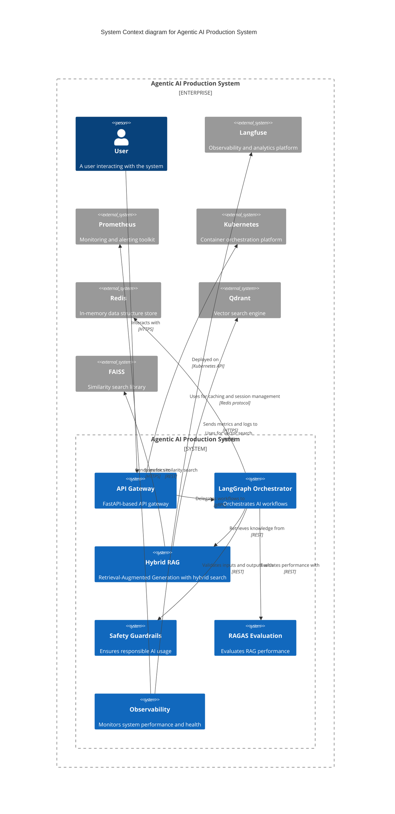
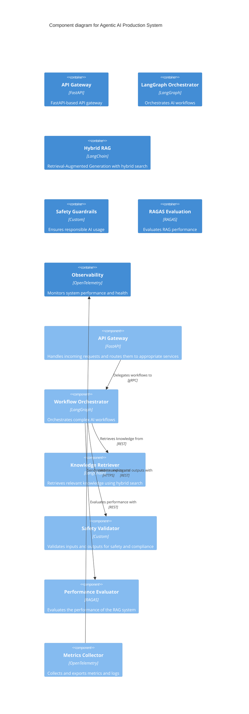
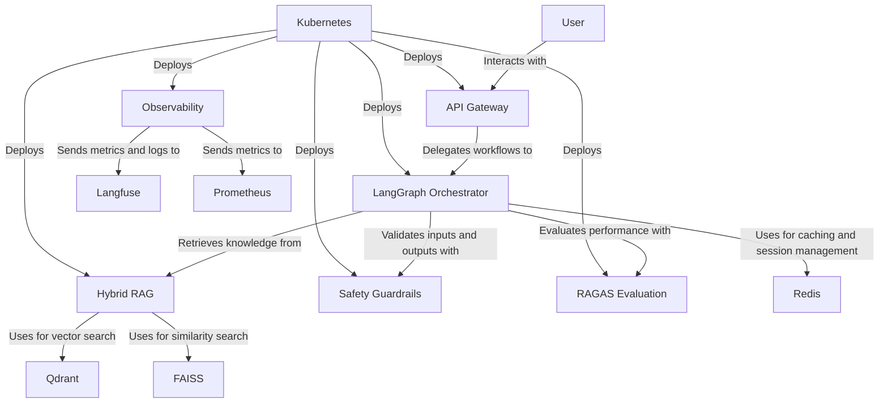

```markdown
# Architecture

## Overview

The `agentic-ai-production-system` is a production-grade agentic AI system designed to orchestrate complex AI workflows with a focus on reliability, scalability, and observability. The system leverages LangGraph for orchestration, hybrid RAG for knowledge retrieval, safety guardrails to ensure responsible AI usage, RAGAS for evaluation, and Prometheus + Langfuse for observability. The system is containerized using Docker and deployed on Kubernetes with Horizontal Pod Autoscaler (HPA) for scalability. Human-in-the-loop capabilities are integrated to ensure quality and safety.

## C4 Context Diagram



## Component Diagram



## Data Flow Diagram



## Key Design Decisions

1. **LangGraph Orchestration**: Chosen for its robust workflow orchestration capabilities, allowing complex AI workflows to be defined and managed efficiently.
2. **Hybrid RAG**: Implemented to combine the strengths of vector search (Qdrant) and similarity search (FAISS) for more accurate and relevant knowledge retrieval.
3. **Safety Guardrails**: Custom-built to ensure responsible AI usage, including PII protection, toxicity detection, and injection prevention.
4. **RAGAS Evaluation**: Integrated for continuous evaluation of the RAG system's performance, ensuring high-quality outputs.
5. **Observability**: Leveraged Prometheus and Langfuse for comprehensive monitoring, logging, and analytics to ensure system reliability and performance.
6. **Kubernetes Deployment**: Chosen for its scalability, reliability, and ease of management, with HPA for automatic scaling based on demand.
7. **Human-in-the-Loop**: Integrated to ensure quality and safety, allowing human reviewers to intervene and correct outputs when necessary.

## Technology Choices with Rationales

| Technology          | Rationale                                                                                                                                 |
|---------------------|-------------------------------------------------------------------------------------------------------------------------------------------|
| Python 3.11         | Chosen for its performance, readability, and extensive ecosystem of libraries for AI and machine learning.                              |
| LangGraph           | Selected for its robust workflow orchestration capabilities, making it ideal for complex AI workflows.                                  |
| LangChain           | Used for its comprehensive suite of tools and utilities for building AI applications, including RAG and evaluation.                       |
| FastAPI             | Chosen for its high performance, ease of use, and built-in support for asynchronous operations, making it ideal for building APIs.        |
| FAISS               | Selected for its high-performance similarity search capabilities, making it suitable for hybrid RAG.                                      |
| Redis               | Chosen for its in-memory data structure store capabilities, making it ideal for caching and session management.                         |
| Qdrant              | Selected for its vector search capabilities, making it suitable for hybrid RAG.                                                         |
| Prometheus          | Chosen for its robust monitoring and alerting capabilities, providing comprehensive observability for the system.                         |
| OpenTelemetry       | Selected for its vendor-neutral approach to observability, making it ideal for collecting and exporting metrics and logs.                |
| Langfuse            | Chosen for its specialized focus on AI observability, providing detailed analytics and insights for AI applications.                    |
| Docker              | Selected for its containerization capabilities, making it easy to package and deploy the system.                                        |
| Kubernetes          | Chosen for its scalability, reliability, and ease of management, making it ideal for deploying and managing the system at scale.        |
| Terraform           | Selected for its infrastructure as code capabilities, making it easy to provision and manage the infrastructure required for the system. |

## Conclusion

The `agentic-ai-production-system` is designed to be a robust, scalable, and observable platform for building and deploying agentic AI systems. By leveraging the right technologies and design decisions, the system ensures high performance, reliability, and responsible AI usage.
```