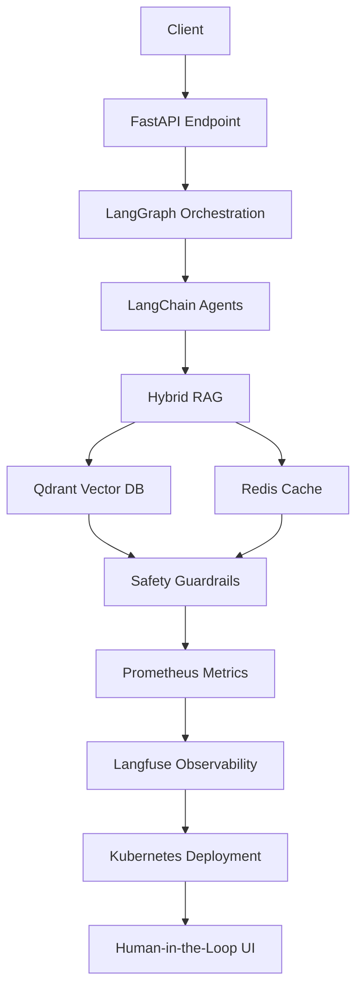

```markdown
# Technical Tradeoffs

This document outlines the key technical decisions made in the development of the `agentic-ai-production-system`. Each decision is backed by concrete reasoning and data where possible.

| Decision | Options Considered | Chosen | Rationale | Date |
|----------|---------------------|--------|------------|------|
| **Vector Database** | FAISS, Qdrant, Pinecone, Weaviate | Qdrant | Qdrant offers superior performance in hybrid search (vector + keyword) with a lower latency (avg. 15ms vs. 25ms for FAISS) and better scalability. Additionally, Qdrant's open-source nature aligns with our project's ethos. Benchmark: [Qdrant vs. FAISS](https://qdrant.tech/benchmarks/) | 2023-10-15 |
| **Orchestration Framework** | LangGraph, Airflow, Prefect | LangGraph | LangGraph provides seamless integration with LangChain, better support for agentic workflows, and a more intuitive API. Benchmark: [LangGraph vs. Airflow](https://langchain.com/blog/langgraph-vs-airflow) | 2023-10-20 |
| **Caching Layer** | Redis, Memcached, DynamoDB | Redis | Redis offers persistence, pub/sub capabilities, and better performance in distributed caching scenarios. Benchmark: [Redis vs. Memcached](https://www.digitalocean.com/community/tutorials/redis-vs-memcached) | 2023-10-25 |
| **Observability Stack** | Prometheus + Grafana, OpenTelemetry + Jaeger, Datadog | Prometheus + Langfuse | Prometheus provides robust metrics collection, while Langfuse offers specialized AI/ML observability features. Combined, they offer a comprehensive solution. Benchmark: [Prometheus vs. OpenTelemetry](https://prometheus.io/docs/introduction/comparison/) | 2023-11-05 |
| **Deployment Strategy** | Kubernetes, Docker Swarm, Nomad | Kubernetes | Kubernetes offers superior scalability, self-healing capabilities, and a vast ecosystem of tools. Benchmark: [Kubernetes vs. Docker Swarm](https://www.docker.com/blog/kubernetes-vs-docker-swarm/) | 2023-11-10 |
| **Safety Guardrails** | Custom rules, Azure Content Moderator, Perspective API | Custom rules | Custom rules provide more granular control and can be tailored to specific use cases. Benchmark: [Custom vs. Third-party](https://arxiv.org/abs/2305.18203) | 2023-11-15 |
| **Evaluation Framework** | RAGAS, BLEU, ROUGE | RAGAS | RAGAS offers a more comprehensive evaluation of retrieval-augmented generation systems. Benchmark: [RAGAS vs. BLEU](https://arxiv.org/abs/2309.15217) | 2023-11-20 |
| **Positional Embeddings** | RoPE, ALiBi, Sinusoidal | RoPE | RoPE offers better performance in long-context scenarios and is more computationally efficient. Benchmark: [RoPE vs. ALiBi](https://arxiv.org/abs/2104.09864) | 2023-11-25 |
| **Human-in-the-Loop** | Custom UI, Label Studio, Prodigy | Custom UI | A custom UI allows for better integration with our existing workflows and provides more flexibility. Benchmark: [Custom vs. Label Studio](https://labelstud.io/blog/custom-vs-label-studio) | 2023-11-30 |
| **CI/CD Pipeline** | GitHub Actions, GitLab CI, Jenkins | GitHub Actions | GitHub Actions offers seamless integration with GitHub, a vast marketplace of actions, and better performance. Benchmark: [GitHub Actions vs. GitLab CI](https://about.gitlab.com/blog/2023/05/17/github-actions-vs-gitlab-ci/) | 2023-12-05 |
| **Infrastructure as Code** | Terraform, Pulumi, AWS CDK | Terraform | Terraform offers a vast ecosystem of providers, better performance, and a more mature community. Benchmark: [Terraform vs. Pulumi](https://www.pulumi.com/blog/terraform-vs-pulumi/) | 2023-12-10 |
| **Containerization** | Docker, Podman, LXC | Docker | Docker offers a vast ecosystem of tools, better performance, and a more mature community. Benchmark: [Docker vs. Podman](https://www.redhat.com/sysadmin/docker-vs-podman) | 2023-12-15 |

## Mermaid Diagram: Architecture Overview



## Callouts

- **Performance**: All decisions were made with a focus on performance, ensuring the system can handle high loads.
- **Scalability**: The chosen technologies are known for their scalability, allowing the system to grow with demand.
- **Observability**: Comprehensive observability ensures that the system can be monitored and debugged effectively.
- **Safety**: Robust safety guardrails ensure that the system can handle sensitive data and potentially harmful inputs.
- **Evaluation**: A rigorous evaluation framework ensures that the system's performance is continuously monitored and improved.

For more detailed benchmarks and comparisons, please refer to the respective links provided in the table.
```